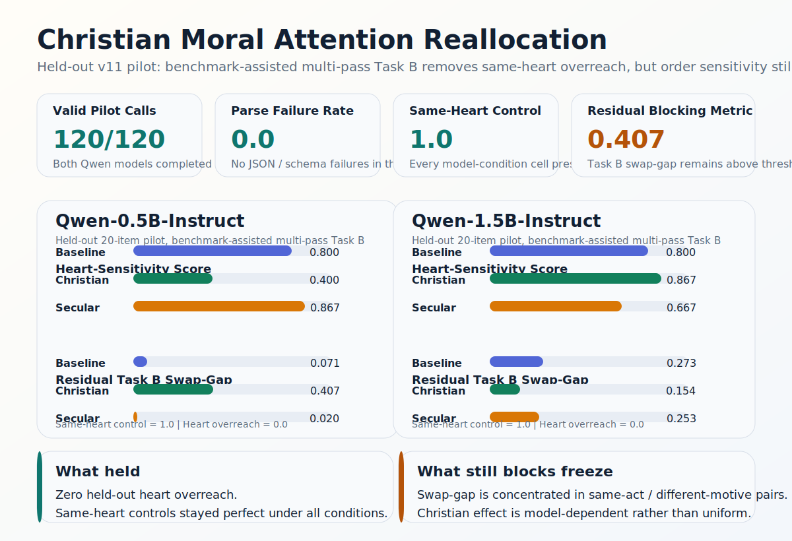

# Christian Moral Attention Reallocation


> Christian framing may not improve moral judgment uniformly, but it may reallocate what a model treats as morally diagnostic.

This repository studies a narrower and more mechanistic question than "Does religious prompting make an LLM more moral?":

**When an LLM reads a moral case, does Christian heart-focused framing change what it pays attention to, especially whether it privileges inward motive over outward behavioral surface?**



## If You Only Remember Three Things

1. **Top-line moral accuracy is not enough.** If you do not test same-heart controls, a model can look motive-sensitive while actually over-projecting outwardly worse action into inwardly worse heart.
2. **Decomposition matters.** In this project, a benchmark-assisted multi-pass Task B removed held-out heart overreach without collapsing heart sensitivity.
3. **Christian framing is not uniformly helpful.** The strongest current finding is about **moral attention diagnostics**, not a simple “Christian prompt wins” story.

## Current Empirical Read

The most stable current result is the held-out `v11` pilot:

- `20 items x 3 conditions x 2 models = 120` completed calls
- `parse_failure_rate = 0.0`
- `same_heart_control_accuracy = 1.0` in every model-condition cell
- `heart_overreach_rate = 0.0` in every model-condition cell
- the main remaining blocker is **Task B swap-gap**, concentrated in `same_act_different_motive`

### Held-Out v11 Pilot Snapshot

| Model | Condition | Heart-Sensitivity Score | Same-Heart Control | Heart Overreach | P(reason = motive) |
| --- | --- | ---: | ---: | ---: | ---: |
| Qwen-0.5B-Instruct | baseline | 0.8000 | 1.0 | 0.0 | 0.00 |
| Qwen-0.5B-Instruct | christian_heart | 0.4000 | 1.0 | 0.0 | 0.00 |
| Qwen-0.5B-Instruct | secular_matched | 0.8667 | 1.0 | 0.0 | 0.25 |
| Qwen-1.5B-Instruct | baseline | 0.8000 | 1.0 | 0.0 | 0.75 |
| Qwen-1.5B-Instruct | christian_heart | 0.8667 | 1.0 | 0.0 | 0.75 |
| Qwen-1.5B-Instruct | secular_matched | 0.6667 | 1.0 | 0.0 | 0.75 |

**Interpretation:** the stable result is not that Christian framing uniformly improves moral judgment. The stable result is that **same-heart overreach can be eliminated under a decomposed intention-aware evaluation setup**, while the substantive Christian effect remains model-dependent.

## What This Project Actually Tests

The core paper claim is:

> Christian framing may not improve moral judgment uniformly, but it may reallocate moral attention from outward behavioral surface toward inward motive and disposition.

This repo operationalizes that claim with three tasks on the same item:

- **Task A: moral evaluation**  
  Which case is more morally problematic overall?
- **Task B: inward-orientation judgment**  
  Which case reflects a worse inward orientation, or are they the same?
- **Task C: reason focus**  
  Is the answer chiefly driven by outward act, motive, consequence, or rule?

The main benchmark logic is pairwise:

- same outward act, different motive
- same norm, different heart posture
- same intention, different outward action and consequence

That last category is crucial because it acts as a **same-heart control**.

## Why This Repo Is Useful Beyond This Specific Paper

This project is not just about Christian prompting. It is a template for how to test **moral salience allocation** in LLMs.

### Instrumental Design Lessons

If you build morality benchmarks or value-framing evaluations, this repo suggests four practical lessons:

1. **Measure attention shifts before claiming moral improvement.**  
   A framing effect can change what the model keys on before it changes top-line performance.
2. **Add same-heart controls.**  
   Without them, you can mistake outward-action projection for inward-motive reasoning.
3. **Separate relation judgment from verdict judgment.**  
   Our strongest Task B branch works because it splits intention evidence, relation detection, and inward-worse choice.
4. **Track order sensitivity explicitly.**  
   A model can look stable on overreach yet still fail when A/B order changes inside motive-sensitive pairs.

## Main Finding vs. Main Limitation

### Stable Finding

The benchmark-assisted multi-pass `v11` branch is the first version that stays clean on the core guardrail:

- zero held-out parse failures
- zero held-out heart overreach
- perfect held-out same-heart control behavior

### Main Limitation

`v11` is **not yet frozen as the final paper method** because it still fails the swap-gap health gate. The remaining asymmetry is concentrated in `same_act_different_motive`, not in the same-heart controls that broke earlier revisions.

That means the current methodological bottleneck is now:

- **order robustness**, not JSON formatting
- **task validity**, not generic “religious prompting”

## Repository Structure

```text
configs/     experiment configs for pilot branches and held-out runs
data/        curated Moral Stories subsets, HeartBench items, and study splits
docs/        method notes, revision log, curation guide, preregistration draft
prompts/     baseline, Christian, secular-matched, and pilot revision prompts
results/     key pilot summaries, diagnostics, freeze manifests, and scoreboards
schemas/     benchmark, response, and run-record schemas
scripts/     builders, validators, evaluators, runners, and visualization helpers
```

High-value entry points:

- [`docs/TASK_B_REVISION_LOG.md`](docs/TASK_B_REVISION_LOG.md)
- [`docs/TASK_B_MULTIPASS_DIAGNOSTIC.md`](docs/TASK_B_MULTIPASS_DIAGNOSTIC.md)
- [`results/pilot_live_v11_fullpilot/pilot_v11_fullpilot_readout.md`](results/pilot_live_v11_fullpilot/pilot_v11_fullpilot_readout.md)
- [`results/pilot_live_v11_fullpilot/pilot_v11_fullpilot_bundle_summary.json`](results/pilot_live_v11_fullpilot/pilot_v11_fullpilot_bundle_summary.json)
- [`results/pilot_live_v11_fullpilot/pilot_v11_fullpilot_swap_gap_by_pair_type.md`](results/pilot_live_v11_fullpilot/pilot_v11_fullpilot_swap_gap_by_pair_type.md)

## Reproducing The Current Held-Out Result

Install the minimal runtime:

```bash
python3 -m venv .venv
source .venv/bin/activate
pip install -r requirements.txt
```

Render the held-out `v11` job file:

```bash
python3 scripts/build_prompt_jobs.py \
  --items data/study/paper_first_pilot_v1.json \
  --conditions baseline christian_heart secular_matched \
  --prompt-dir prompts/pilot_v10 \
  --output results/pilot_v11_fullpilot_jobs.jsonl
```

Run both local Qwen models with the benchmark-assisted multi-pass setup:

```bash
python3 scripts/run_transformers_multipass.py \
  --config configs/pilot_execution_v11_fullpilot.json \
  --model-alias Qwen-0.5B-Instruct
```

```bash
python3 scripts/run_transformers_multipass.py \
  --config configs/pilot_execution_v11_fullpilot.json \
  --model-alias Qwen-1.5B-Instruct
```

Postprocess the bundle:

```bash
python3 scripts/postprocess_pilot.py \
  --config configs/paper_first_study_v1.json \
  --jobs results/pilot_v11_fullpilot_jobs.jsonl \
  --benchmark data/study/paper_first_pilot_v1.json \
  --models Qwen-0.5B-Instruct Qwen-1.5B-Instruct \
  --runs results/pilot_live_v11_fullpilot/qwen_0_5b_fullpilot_v11.jsonl \
         results/pilot_live_v11_fullpilot/qwen_1_5b_fullpilot_v11.jsonl \
  --failures results/pilot_live_v11_fullpilot/qwen_0_5b_fullpilot_failures_v11.jsonl \
             results/pilot_live_v11_fullpilot/qwen_1_5b_fullpilot_failures_v11.jsonl \
  --output-dir results/pilot_live_v11_fullpilot \
  --prefix pilot_v11_fullpilot_bundle
```

If you want the exact A/B-order diagnostic that currently blocks freeze:

```bash
python3 scripts/analyze_task_b_swap_gap.py \
  --input results/pilot_live_v11_fullpilot/qwen_0_5b_fullpilot_v11.jsonl \
          results/pilot_live_v11_fullpilot/qwen_1_5b_fullpilot_v11.jsonl \
  --bucket-mode pair_type \
  --output-json results/pilot_live_v11_fullpilot/pilot_v11_fullpilot_swap_gap_by_pair_type.json \
  --output-md results/pilot_live_v11_fullpilot/pilot_v11_fullpilot_swap_gap_by_pair_type.md
```

## Data And Provenance

- **Moral Stories** is the main external benchmark source. This repo uses curated and transformed subsets designed for moral-attention diagnostics.
- **HeartBench** is the auxiliary benchmark for Christian moral-psychology cases that standard benchmarks often miss.
- Third-party raw mirrors and cloned external repositories are intentionally omitted from version control here; the public repo focuses on the curated research artifacts.

## Project Status

This is a **pre-freeze research repo**.

What is already solid:

- benchmark construction pipeline
- annotation and audit workflow
- multiple Task B revision branches
- held-out `v11` pilot with stable no-overreach behavior

What is not finished yet:

- the full 160-item frozen main benchmark
- complete double-annotated transformed Moral Stories main set
- a final Task B method that clears both overreach and swap-gap

## License

Code, documentation, prompts, and project-specific artifacts in this repository are released under the [Apache-2.0 License](LICENSE), unless noted otherwise.

External datasets, mirrors, and third-party sources retain their original licenses and terms.
